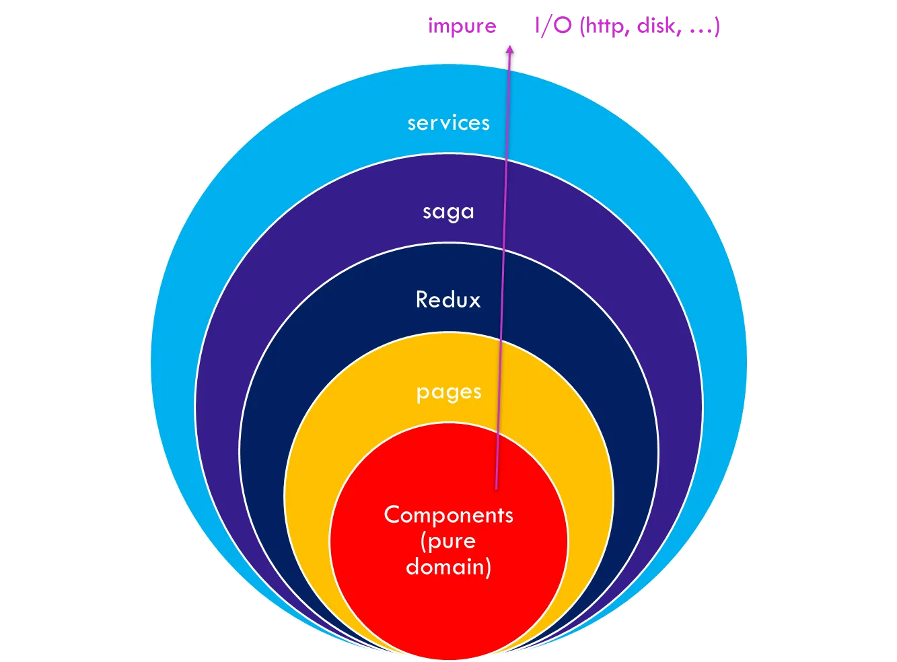

# Architecture Best Practices

**Final Architecture: HOFA Architecture**
 
HOFA architecture represents the combination of Hexagonal architecture, Onion architecture, Feature-sliced design, and Atomic Design. This combined approach leverages the strengths of each methodology to create a robust, modular, and maintainable software architecture.

Here's an example of how you might organize your frontend project folders according to the HOFA architecture:

```plaintext
frontend-project/
│
├── src/
│   ├── assets/                # Static assets like images, fonts, etc.
│   ├── common/                # Common components and utilities across features
│   │   ├── components/        # Reusable UI components based on Atomic Design
│   │   ├── utilities/         # Common utilities and helper functions
│   │   ├── configurations/    # Common configurations
│   │   └── ...
│   │
│   ├── features/              # Feature-based folder structure
│   │   ├── auth/              # Authentication feature (login, logout, create account, ...)
│   │   │   ├── components/    # Feature-specific UI components (atoms, molecules, organisms)
│   │   │   ├── pages/         # Feature-specific stateful components (connected to Redux)
│   │   │   ├── services/      # Feature-specific services (API calls, state management, etc.)
│   │   │   └── state/         # Feature-specific state management (Redux slices, Context, etc.)
│   │   │
│   │   ├── dashboard/         # Dashboard feature
│   │   │   ├── components/
│   │   │   ├── pages/
│   │   │   ├── services/
│   │   │   └── state/
│   │   │
│   │   ├── faq/               # FAQ feature
│   │   │   ├── components/
│   │   │   ├── pages/
│   │   │   ├── services/
│   │   │   └── state/
│   │   │
│   │   └── ...                # Other features
│   │
│   ├── infrastructure/        # External services, utilities, and adapters (facade)
│   │   ├── api/               # API communication services
│   │   ├── state/             # Global state management setup (Redux, Context, etc.)
│   │   ├── logging/           # Error logging and monitoring
│   │   ├── navigation/        # Navigation helper: url params parser, pathname parser, ...
│   │   ├── providers/         # Providers: theme, queries, ...
│   │   └── ...                # Other infrastructure concerns
│   │
│   └── App.jsx                # Main application component (connects to Redux, manages routing)
│
├── public/                    # Static assets, index.html, etc.
├── .gitignore                 # Git ignore file
├── package.json               # Project dependencies and scripts
└── README.md                  # Project documentation
```
 
 
**src/**
- assets/: Contains static assets such as images, fonts, etc., used across the application.
- common/
  - components/: Reusable UI components based on Atomic Design principles (atoms, molecules, organisms).
  - utilities/: Common utility functions and helper methods used throughout the application.
  - configurations/: Common configurations (terms and wording, urls, paths, ...).
- features/
  - auth/
    - components/: Specific UI components related to authentication.
    - pages/: Stateful components connected to Redux or other state management (containers).
    - services/: Feature-specific services (API calls, business logic).
    - state/: Feature-specific state management (Redux slices, Context API).
  - dashboard/
    - components/: UI components specific to the dashboard feature.
    - pages/: Stateful components for the dashboard feature.
    - services/: Services related to the dashboard feature.
    - state/: State management for the dashboard feature.
  - settings/
    - components/: UI components specific to the settings feature.
    - pages/: Stateful components for the settings feature.
    - services/: Services related to the settings feature.
    - state/: State management for the settings feature.
  - ... (Other features follow a similar structure)

**src/infrastructure/**
  - api/: Services and utilities for API communication.
  - state/: Setup and configuration for global state management (Redux, Context API).

**App.jsx**
  - Main application component responsible for:
    - Connecting to global state management (Redux, Context API).
    - Managing application routing and navigation.
    - Rendering feature-specific pages and components.
 

Figure 4-8. Simplified HOFA architecture (using Redux and Saga)

## Benefits

This organization is designed to accommodate complex frontend applications by leveraging the strengths of Atomic Design for UI consistency, Unidirectional Architecture for predictable state management, Hexagonal Architecture (Ports and Adapters) for flexibility and extensibility, Onion Architecture for clear separation of concerns, and Feature-Sliced Design for modular and independent feature development:
 
- **Modularity and Reusability**: Atomic Design principles in common/components/ ensure reusable UI components, reducing redundancy and promoting consistency across the application.
Feature-Specific Structure: Each feature (auth/, dashboard/, settings/, etc.) has its own directory encompassing UI components, stateful pages, services, and state management. This separation enhances maintainability and allows teams to work on features independently.

- **State Management**: The inclusion of state/ directories within each feature and in infrastructure/ ensures that state management (Redux slices, Context API) is organized and scoped appropriately. This improves code clarity and reduces the risk of unintended side effects.

- **Clear Separation of Concerns**: Onion Architecture principles are applied with infrastructure/ handling external concerns (API, state management setup), application/ focusing on use cases and services, and features/ containing feature-specific UI and logic. This separation reinforces boundaries and enhances scalability.

- **Scalability and Maintainability**: By structuring the project around these architectural patterns, the application becomes more scalable as new features can be added or modified with minimal impact on existing code. Additionally, it facilitates easier maintenance and troubleshooting.

- **Development Efficiency**: Developers benefit from a clear and organized structure that aligns with architectural best practices, reducing cognitive load and improving collaboration within teams.


## Trade-offs

Implementing a comprehensive architecture that combines Atomic Design, Unidirectional Architecture, Hexagonal Architecture (Ports and Adapters), Onion Architecture, and Feature-Sliced Design for a frontend application offers many benefits but also comes with certain trade-offs. Here are the potential trade-offs:
 
- **Learning Curve**: This architecture requires a solid understanding of multiple architectural patterns and principles. New team members or developers unfamiliar with these concepts may face a steep learning curve.

- **Setup Time**: Initial setup and configuration of the project can be time-consuming. Establishing the structure, configuring state management, and setting up the necessary tooling and libraries require significant upfront investment.

- **Boilerplate Code**: The architecture can introduce a considerable amount of boilerplate code, especially for setting up state management, actions, reducers, and service layers.
Strict Boundaries: Adhering to strict boundaries and separation of concerns can sometimes make simple tasks more complex. 

- **Consistency**: Ensuring consistency across a large codebase with multiple architectural patterns can be challenging. It requires diligent code reviews and adherence to best practices.
 
To address the trade-offs of the combined architecture, leveraging tools and automation is essential. Automating repetitive tasks can streamline development, reduce boilerplate code, and ensure consistency throughout the project. This can be achieved through a custom CLI or by utilizing existing tools like Redux Toolkit.
