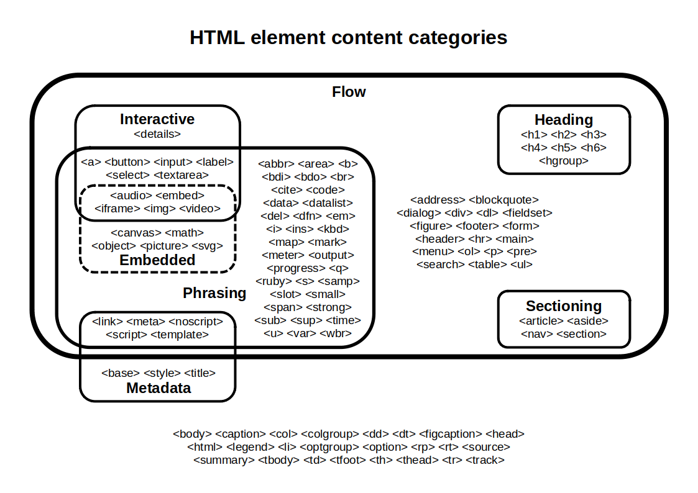
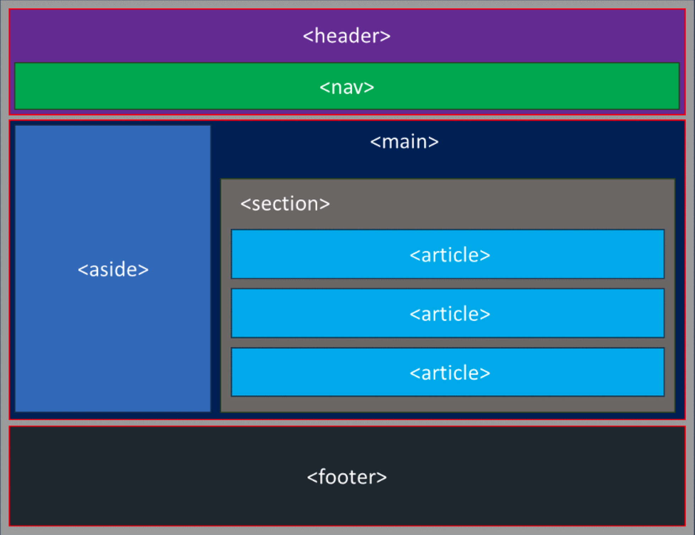

# HTML

## Doctype Declaration

- Ensure the HTML document begins with a proper doctype declaration: `<!DOCTYPE html>`.

> In [HTML](https://developer.mozilla.org/en-US/docs/Glossary/HTML), the doctype is the required "<!DOCTYPE html>" preamble found at the top of all documents. Its sole purpose is to prevent a [browser](https://developer.mozilla.org/en-US/docs/Glossary/Browser) from switching into so-called ["quirks mode"](https://developer.mozilla.org/en-US/docs/Web/HTML/Quirks_Mode_and_Standards_Mode) when rendering a document; that is, the "<!DOCTYPE html>" doctype ensures that the browser makes a best-effort attempt at following the relevant specifications, rather than using a different rendering mode that is incompatible with some specifications.

## HTML Structure

- Use the correct HTML structure, including `<html>`, `<head>`, and `<body>` tags.

## Character Encoding

- Specify the character encoding for the document: `<meta charset="UTF-8">`.

## Title Element

- Ensure each page has a unique and descriptive `<title>` element.

## Meta Description

- Provide a meta description for search engines: `<meta name="description" content="The page description here">`.

## Responsive Design

- Use the viewport meta tag to ensure the site is mobile-friendly: `<meta name="viewport" content="width=device-width, initial-scale=1.0">`.
- Never use `maximum-scale`, `minimum-scale`, `user-scalable=no`.
- Ensure the site is fully responsive and works on various screen sizes and orientations.
- Use media queries to adapt layouts for different devices.

## Semantic HTML

- Each element in HTML falls into zero or more categories that group elements with similar characteristics together. These categories are important for understanding what constitutes valid markup in HTML:

- Use semantic HTML elements to structure the content meaningfully, such as `<header>`, `<nav>`, `<main>`, `<section>`, `<article>`, and `<footer>`.

When you have doubts, you can refer to MDN or HTML specification documentation:

- [MDN Element Technical Summary](https://developer.mozilla.org/en-US/docs/Web/HTML/Element/textarea#technical_summary).
- [HTML Element Specification](https://html.spec.whatwg.org/multipage/input.html#the-input-element).

## Headings

- Use headings (`<h1>` to `<h6>`) to create a logical document structure. Avoid skipping heading levels.

## Sections and Articles

- Use `<section>` to define sections in the document. Each section should be thematically grouped.
- Use `<article>` for self-contained content that can be independently distributed or reused (e.g., blog posts, news articles).
  If you have any doubts, you can refer to this documentation:

- [MDN Section](https://developer.mozilla.org/en-US/docs/Web/HTML/Element/section).
- [MDN Article](https://developer.mozilla.org/en-US/docs/Web/HTML/Element/article).
- [HTML Element Flow Chart](https://i.sstatic.net/8Ruyj.png)

## Lists

- Use `<ul>` for unordered lists and `<ol>` for ordered lists.
- Ensure list items (`<li>`) are used correctly within the list elements.

## Tables

- Use `<table>`, `<thead>`, `<tbody>`, and `<tfoot>` elements for tabular data. Provide `<th>` elements for headers.

## Scripts and Styles

- Include external scripts and stylesheets using `<link>` for CSS and `<script>` for JavaScript, placed appropriately.

## Validate HTML & Heading

- Ensure the HTML is valid by using a validator such as the [W3C Markup Validation Service](https://validator.w3.org/) or [NU Validator](https://validator.w3.org/nu/).
